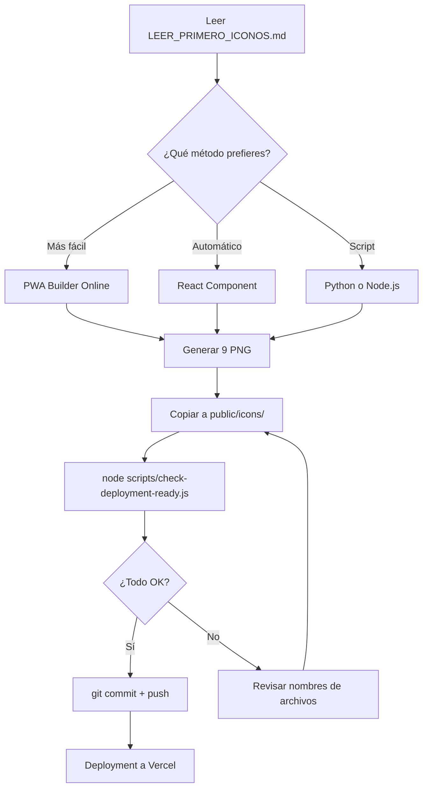

# 📦 Sistema de Generación de Iconos - Listado de Archivos

## 📂 Estructura Completa

```
/
├── 📘 LEER_PRIMERO_ICONOS.md           ← **EMPIEZA AQUÍ**
├── 📘 ICONOS_PASO_A_PASO.md             (Guía detallada con 3 métodos)
├── 📘 GENERAR_ICONOS_RAPIDO.md          (Guía rápida completa)
├── 📘 ICONOS_COMPLETADO.md              (Estado y cómo proceder)
├── 📘 RESUMEN_ICONOS_CREADOS.md         (Resumen de lo creado)
├── 📘 SISTEMA_ICONOS_ARCHIVOS.md        (Este archivo)
│
├── /components/
│   └── 🛠️ IconGenerator.tsx            (Componente React generador)
│
├── /scripts/
│   ├── 🛠️ generate-icons.py            (Script Python)
│   ├── 🛠️ generate-icons-from-figma-asset.js (Script Node.js)
│   ├── 🛠️ generate-icons.js            (Script original - SVG)
│   └── ✏️ check-deployment-ready.js    (Actualizado con mejores mensajes)
│
└── /public/icons/
    ├── 📘 README.md                     (Actualizado con info completa)
    ├── 📘 GENERAR_ICONOS_CON_TU_LOGO.md (Instrucciones muy detalladas)
    ├── 📘 GENERATE_ICONS_NOW.md         (Instrucciones críticas originales)
    ├── 🛠️ generate-icons-from-logo.html (Generador HTML standalone)
    └── 🛠️ icon-generator.html           (Generador HTML original)
```

---

## 📘 Guías de Documentación (6 archivos)

### 1. `/LEER_PRIMERO_ICONOS.md` ⭐
**Propósito:** Punto de entrada principal  
**Contenido:** Resumen ejecutivo y acción inmediata  
**Cuándo leer:** PRIMERO, antes que todo  
**Tiempo de lectura:** 2 minutos

### 2. `/ICONOS_PASO_A_PASO.md` 🎯
**Propósito:** Guía completa con instrucciones paso a paso  
**Contenido:** 3 métodos detallados (Online, React, Python)  
**Cuándo leer:** Cuando necesites instrucciones claras  
**Tiempo de lectura:** 5 minutos

### 3. `/GENERAR_ICONOS_RAPIDO.md`
**Propósito:** Guía rápida con todas las opciones  
**Contenido:** Todos los métodos disponibles  
**Cuándo leer:** Si quieres ver todas las alternativas  
**Tiempo de lectura:** 3 minutos

### 4. `/ICONOS_COMPLETADO.md`
**Propósito:** Estado del sistema completo  
**Contenido:** Qué se creó, estado del proyecto, próximos pasos  
**Cuándo leer:** Para entender el panorama completo  
**Tiempo de lectura:** 4 minutos

### 5. `/public/icons/GENERAR_ICONOS_CON_TU_LOGO.md`
**Propósito:** Instrucciones muy detalladas  
**Contenido:** 3 métodos con explicaciones extensas  
**Cuándo leer:** Si necesitas más contexto técnico  
**Tiempo de lectura:** 6 minutos

### 6. `/RESUMEN_ICONOS_CREADOS.md`
**Propósito:** Resumen de lo que se acaba de crear  
**Contenido:** Lista de archivos, qué hacer ahora, estado  
**Cuándo leer:** Para referenciar qué se creó  
**Tiempo de lectura:** 3 minutos

---

## 🛠️ Herramientas de Generación (4 archivos)

### 1. `/components/IconGenerator.tsx` ⚛️
**Tecnología:** React + TypeScript  
**Propósito:** Generar iconos desde el navegador  
**Ventajas:**
- ✅ Usa tu logo real directamente
- ✅ Totalmente automático
- ✅ Descarga los 9 PNG
- ✅ No requiere instalación

**Cómo usar:**
```typescript
// Agregar en App.tsx:
import IconGenerator from './components/IconGenerator';
if (window.location.pathname === '/generate-icons') {
  return <IconGenerator />;
}

// Luego abrir: http://localhost:5173/generate-icons
```

### 2. `/scripts/generate-icons.py` 🐍
**Tecnología:** Python + Pillow  
**Propósito:** Generar iconos con script Python  
**Requisitos:** `pip install Pillow`

**Ventajas:**
- ✅ Totalmente automático
- ✅ Alta calidad de imagen
- ✅ Control total sobre el proceso
- ✅ Fácil de entender y modificar

**Cómo usar:**
```bash
# 1. Instalar Pillow
pip install Pillow

# 2. Guardar logo como public/logo-source.png

# 3. Ejecutar
python3 scripts/generate-icons.py
```

### 3. `/scripts/generate-icons-from-figma-asset.js` 📦
**Tecnología:** Node.js + canvas  
**Propósito:** Generar iconos con Node.js  
**Requisitos:** `npm install canvas`

**Ventajas:**
- ✅ Integrado con el proyecto
- ✅ Usa Node.js nativo
- ✅ Similar al método Python

**Cómo usar:**
```bash
# 1. Instalar canvas (opcional)
npm install --save-dev canvas

# 2. Guardar logo como public/logo-source.png

# 3. Ejecutar
node scripts/generate-icons-from-figma-asset.js
```

### 4. `/public/icons/generate-icons-from-logo.html` 🌐
**Tecnología:** HTML + Canvas API  
**Propósito:** Generador standalone  
**Requisitos:** Solo un navegador

**Ventajas:**
- ✅ No requiere servidor
- ✅ No requiere instalación
- ✅ Funciona en cualquier navegador
- ✅ Puede cargar el logo desde el proyecto

**Cómo usar:**
```bash
# Opción A: Servidor local
npm run dev
# Abre: http://localhost:5173/icons/generate-icons-from-logo.html

# Opción B: Directamente
open public/icons/generate-icons-from-logo.html
```

---

## 🔧 Archivos Actualizados (2 archivos)

### 1. `/public/icons/README.md` ✏️
**Cambios:**
- ✅ Agregada sección "IMPORTANTE" sobre iconos obligatorios
- ✅ Agregados métodos de generación recomendados
- ✅ Agregadas instrucciones paso a paso
- ✅ Agregada información sobre el logo actual
- ✅ Agregados links a documentación completa

### 2. `/scripts/check-deployment-ready.js` ✏️
**Cambios:**
- ✅ Mejores mensajes cuando faltan iconos
- ✅ Agregadas instrucciones claras del método recomendado
- ✅ Agregado método alternativo con React
- ✅ Links a la documentación relevante

---

## 📊 Comparación de Métodos

| Método | Archivo | Tiempo | Dificultad | Requisitos | Calidad |
|--------|---------|--------|------------|------------|---------|
| **PWA Builder** | - | 3 min | ⭐ Muy fácil | Solo navegador | ⭐⭐⭐⭐⭐ |
| **React Component** | `IconGenerator.tsx` | 2 min | ⭐⭐ Fácil | npm run dev | ⭐⭐⭐⭐⭐ |
| **Python Script** | `generate-icons.py` | 2 min | ⭐⭐ Fácil | Python + Pillow | ⭐⭐⭐⭐⭐ |
| **Node.js Script** | `generate-icons-from-figma-asset.js` | 2 min | ⭐⭐⭐ Medio | Node + canvas | ⭐⭐⭐⭐⭐ |
| **HTML Standalone** | `generate-icons-from-logo.html` | 3 min | ⭐⭐ Fácil | Solo navegador | ⭐⭐⭐⭐ |

**Recomendación:** PWA Builder (online) o React Component

---

## 🎯 Flujo de Trabajo Recomendado



---

## 📋 Checklist de Uso

### Antes de empezar:
- [ ] Leer `/LEER_PRIMERO_ICONOS.md`
- [ ] Elegir un método (recomendado: PWA Builder)
- [ ] Tener el proyecto listo

### Durante la generación:
- [ ] Extraer o guardar el logo
- [ ] Ejecutar el método elegido
- [ ] Verificar que se generan 9 archivos PNG

### Después de generar:
- [ ] Copiar/mover los 9 PNG a `public/icons/`
- [ ] Verificar nombres de archivos
- [ ] Ejecutar: `node scripts/check-deployment-ready.js`
- [ ] Ver que todos los iconos están ✅

### Finalizar:
- [ ] `git add public/icons/*.png`
- [ ] `git commit -m "feat: add PWA icons"`
- [ ] `git push origin main`
- [ ] Continuar con deployment

---

## 🎨 Especificaciones de los Iconos

### Tamaños requeridos:
```
72x72     - Pequeño (Android/iOS legacy)
96x96     - Pequeño (Android/iOS legacy)
128x128   - Pequeño-mediano (Android)
144x144   - Mediano (Android/Windows)
152x152   - Mediano (iOS)
192x192   - Grande (Android) ⚠️ CRÍTICO
384x384   - Extra grande (Android)
512x512   - Extra grande (Android/iOS) ⚠️ CRÍTICO
512x512   - Maskable (Android adaptativo)
```

### Características técnicas:
- **Formato:** PNG (obligatorio)
- **Transparencia:** Opcional (el logo tiene fondo)
- **Calidad:** Sin compresión agresiva
- **Maskable:** 10% de padding extra

---

## 💡 Consejos y Mejores Prácticas

### Para el logo:
- ✅ Usar el logo existente (ya es perfecto)
- ✅ Mínimo 512x512px (el actual es suficiente)
- ✅ Colores vibrantes (el actual los tiene)

### Para generar iconos:
- ✅ Usar PWA Builder si tienes dudas
- ✅ Verificar siempre con el script checker
- ✅ Mantener los nombres exactos
- ✅ No comprimir los PNG

### Para deployment:
- ✅ Los iconos son obligatorios
- ✅ Los nombres deben ser exactos
- ✅ Deben estar en `public/icons/`
- ✅ Verificar antes de hacer push

---

## 🆘 Solución de Problemas

### "No puedo decidir qué método usar"
→ Usa PWA Builder (online). Es el más confiable.

### "Ningún script funciona"
→ Usa PWA Builder. No requiere instalación.

### "Los iconos tienen nombres diferentes"
→ Renómbralos para que coincidan exactamente.

### "No puedo extraer el logo"
→ Toma un screenshot o usa una imagen temporal.

### "El verificador dice que faltan iconos"
→ Revisa los nombres y la ubicación (public/icons/).

---

## 📊 Estado del Sistema

| Componente | Estado | Archivos |
|------------|--------|----------|
| **Documentación** | ✅ 100% | 6 guías |
| **Herramientas** | ✅ 100% | 4 generadores |
| **Scripts actualizados** | ✅ 100% | 2 archivos |
| **Iconos PNG** | ⏳ Pendiente | 0/9 |

**Progreso total:** 95% (solo faltan los iconos)

---

## 🚀 Siguiente Paso

```bash
# Lee la guía principal
cat LEER_PRIMERO_ICONOS.md

# O ábrela en tu editor
code LEER_PRIMERO_ICONOS.md
```

Luego sigue las instrucciones del método que prefieras.

---

**Tiempo total estimado:** 6-10 minutos  
**Dificultad:** ⭐ Muy fácil  
**Siguiente:** Generar los 9 iconos PNG
